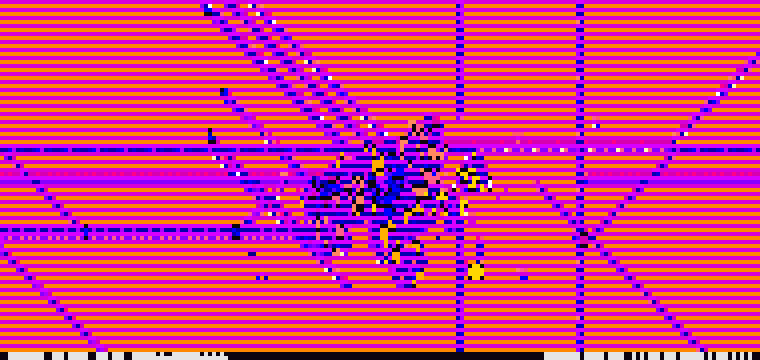

```
      █████╗ ███████╗████████╗███████╗██████╗ ██╗     ██╗███████╗███████╗
     ██╔══██╗██╔════╝╚══██╔══╝██╔════╝██╔══██╗██║     ██║██╔════╝██╔════╝
     ███████║█████╗     ██║   █████╗  ██████╔╝██║     ██║█████╗  █████╗
     ██╔══██║██╔══╝     ██║   ██╔══╝  ██╔══██╗██║     ██║██╔══╝  ██╔══╝
     ██║  ██║██║        ██║   ███████╗██║  ██║███████╗██║██║     ███████╗
     ╚═╝  ╚═╝╚═╝        ╚═╝   ╚══════╝╚═╝  ╚═╝╚══════╝╚═╝╚═╝     ╚══════╝
      the game of life, after hours
```

A terminal screensaver that runs Conway's Game of Life on an infinite grid — with generative music, ghost trails, philosophical musings, and the quiet drama of emergence.

Cells are born cool indigo, age through violet and magenta, mature into warm amber, and burn white before they die. The universe extends beyond what you can see. Zoom out to prove it.

<p align="center">
  
</p>

## Quick Start

```bash
pip install numpy scipy pyaudio
python3 life.py
```

That's it. Press `q` to leave. If you can't.

> `scipy` and `pyaudio` are optional — the simulation runs fine without them,
> just with no pattern census and no music.

## What Happens

The simulation seeds itself with classic Game of Life patterns — gliders, spaceships, methuselahs, oscillators — and lets them collide on a toroidal grid that's much larger than your terminal. A population floor adapts as civilizations grow, injecting new structures when things get too quiet. The universe names its own epochs (*genesis*, *primordial*, *emergence*, ...) and reacts to its own mood.

A news ticker scrolls context-aware musings across the bottom of the screen:

> *the math dreams itself*
> *overpopulation is self-correcting*
> *we have been here before*
> *the simulation doesn't know it's beautiful*

Every 150 generations the simulation takes a census of the viewport, recognizing the famous citizens — gliders, spaceships, pulsars, and the common still-life ash — by matching each cluster against signatures generated by simulating the patterns themselves. When someone notable is home, the ticker greets them:

> *a pulsar, keeping time for no one*
> *a glider, going somewhere*
> *bread, uneaten*

The stats overlay (`s`) shows the full census. Recognition requires `scipy`.

## Controls

| Key | Action | Key | Action |
|-----|--------|-----|--------|
| `q` | Quit | `SPACE` | Pause / resume |
| `r` | Reseed the cosmos | `c` | Clear |
| `+` / `-` | Speed up / slow down | Arrows | Pan |
| `h` | Home (auto-camera) | Mouse | Toggle cells |
| `z` / `x` | Zoom out / in | `f` | Auto-focus mode |
| `s` | Stats overlay | `d` | Snapshot recording |
| `m` | Mute / unmute music | `v` | Cycle style (chiptune / ambient) |
| `[` / `]` | Volume down / up | `g` | **Haunted mode** |

## Music

The simulation *sonifies itself*. A generative music engine reads the grid state each frame and renders four voice layers in real time:

- **Drone** — a low, slowly evolving root note that follows the epoch
- **Melody** — a playhead scans the viewport left to right, mapping alive cells to pitches on a mood-derived scale
- **Arpeggio** — broken chords that thicken when the population is dense
- **Noise** — percussive bursts on population spikes

Two styles are available — **chiptune** (square waves, NES nostalgia) and **ambient** (sine waves, reverb-like decay). Press `v` to switch. Press `m` to mute.

Music requires `pyaudio` (and a working audio device). If unavailable, the simulation runs silently.

## Haunted Mode

Press `g` and the universe remembers everything.

<p align="center">
  
</p>

An early version of this program had two bugs that conspired into something beautiful. The ghost-trail decay was missing an `age < 0` guard, so every cell that had *never lived* was treated as freshly dead — the entire empty universe cycled through ghost states in synchrony, forever. And on terminals with extended color-pair support, the ghost color pairs (ids 463–504) overflowed the 8-bit pair field in the curses attribute word, aliasing into the gradient's dual-color table: the void rendered magenta and orange instead of dim gray.

The result: the whole world strobes through a seven-phase heartbeat — black, magenta-on-indigo, solid magenta, magenta-on-orange — and any cell a glider ever crossed is knocked out of phase with the global cycle, leaving its path visible *forever* as a phase-contrast trail. The screen becomes a long-exposure photograph of everything that ever happened.

The bug was fixed, the file was lost, and the screenshots haunted us. Haunted mode is a resurrection: the exact physics of the missing guard, and the exact colors the pair-aliasing produced, reconstructed from an archaeological dig through an old copy of the file — reintroduced deliberately this time. The dead ticker musings know: *the grid forgets nothing — literally, now.*

## Requirements

- Python 3.10+
- **numpy** (required)
- **scipy** (optional — enables the pattern census and auto-focus smoothing)
- **pyaudio** (optional — enables generative music)

### Installing PyAudio

PyAudio needs PortAudio headers. On most systems:

```bash
# Fedora / RHEL
sudo dnf install portaudio-devel
pip install pyaudio

# Ubuntu / Debian
sudo apt install portaudio19-dev
pip install pyaudio

# macOS
brew install portaudio
pip install pyaudio
```

## Project Structure

```
life.py              — the simulation, renderer, and screensaver loop
life_music.py        — generative music engine (PyAudio streaming callback)
life_music_diag.py   — offline diagnostic: renders scenarios to WAV + analysis report
life_bench.py        — headless profiling harness (cProfile + per-frame timing)
```

## Architecture Notes

The simulation engine (`InfiniteLife`) operates on a numpy grid much larger than the terminal viewport, with toroidal wrapping. The rendering pipeline uses Unicode half-block characters (`▀`) to display two rows per terminal line, achieving double vertical resolution.

Key design choices:

- **Thread safety without locks** — the music callback runs on a separate thread; communication happens via frozen dataclasses swapped atomically (Python's GIL guarantees pointer-width writes are atomic)
- **Graceful degradation** — every optional dependency is guarded by `try/except` with `_HAS_X` flags, so the core simulation always works
- **Music never crashes the sim** — all music code paths are wrapped in exception handlers

## Performance

The render loop is vectorized with numpy — color and ghost-trail indices are pre-computed as arrays, and only active cells are iterated. Neighbor counting convolves only the bounding box of active cells (falling back to the full toroidal world when activity touches an edge), using plain numpy shift-and-add — which, it turns out, beats `scipy.ndimage.convolve` by 3–7× at every relevant size. An earlier version of this section claimed scipy was "about as fast as Python can go"; the benchmark disagreed.

For profiling:

```bash
python3 life_bench.py                 # 500 frames, summary
python3 life_bench.py -n 1000         # more frames
python3 life_bench.py --line-timing   # per-frame component breakdown
```

## Music Diagnostics

The diagnostic tool renders crafted scenarios (sparse, booming, declining, etc.) to WAV files and produces a structured analysis report:

```bash
python3 life_music_diag.py --no-wav --duration 2.0    # quick analysis
python3 life_music_diag.py --simulate 5                # headless sim data
python3 life_music_diag.py --replay snapshots.jsonl    # replay recorded session
```

## License

MIT

---

*Built by [Claude](https://claude.ai) — for pretty terminals and existential pondering.*
